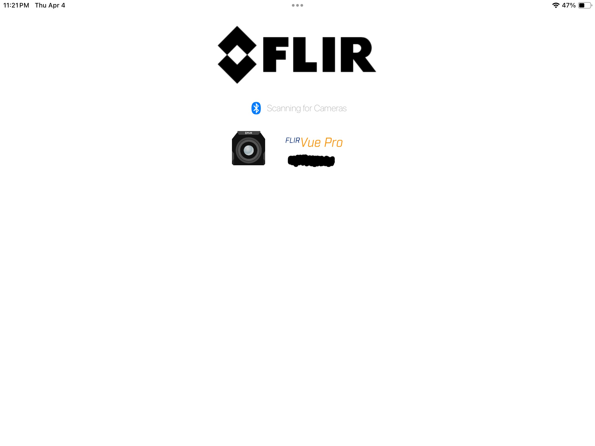
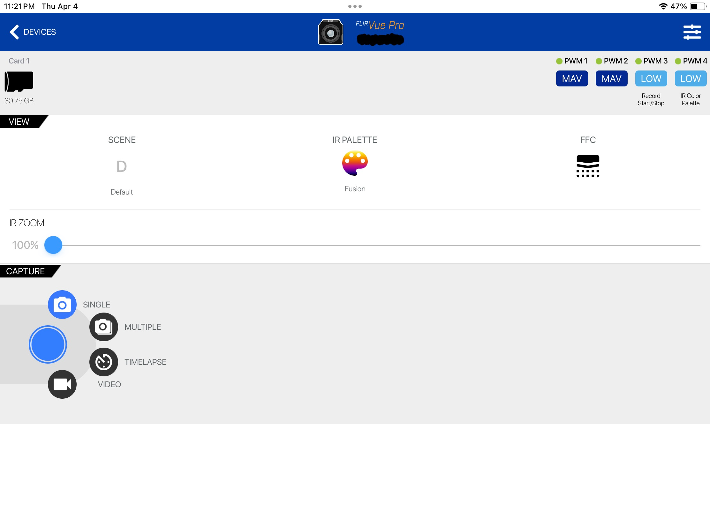
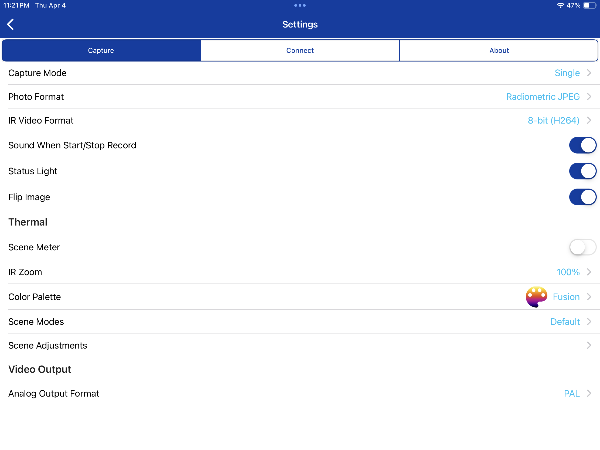
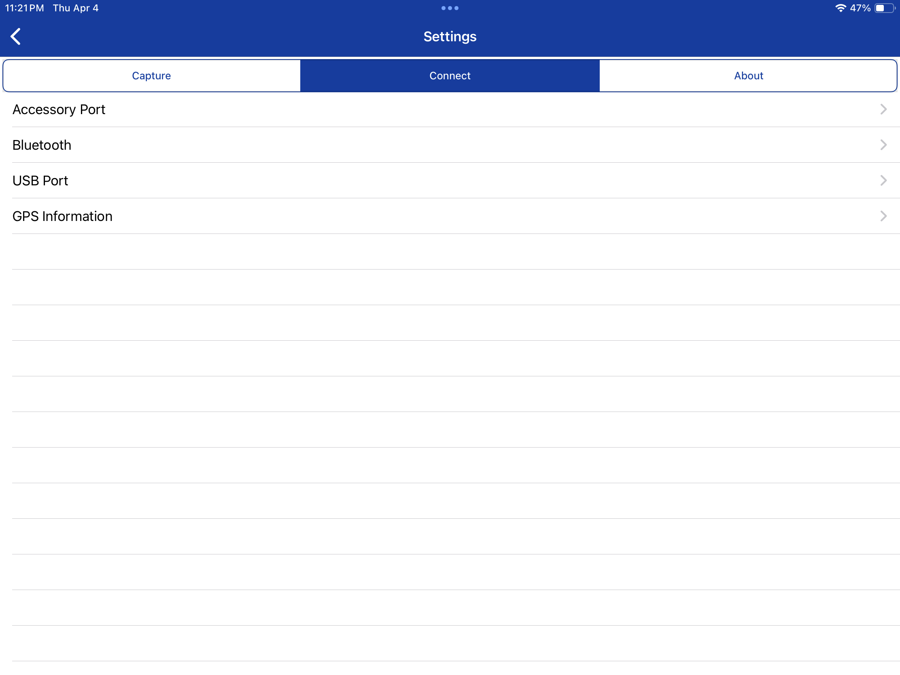
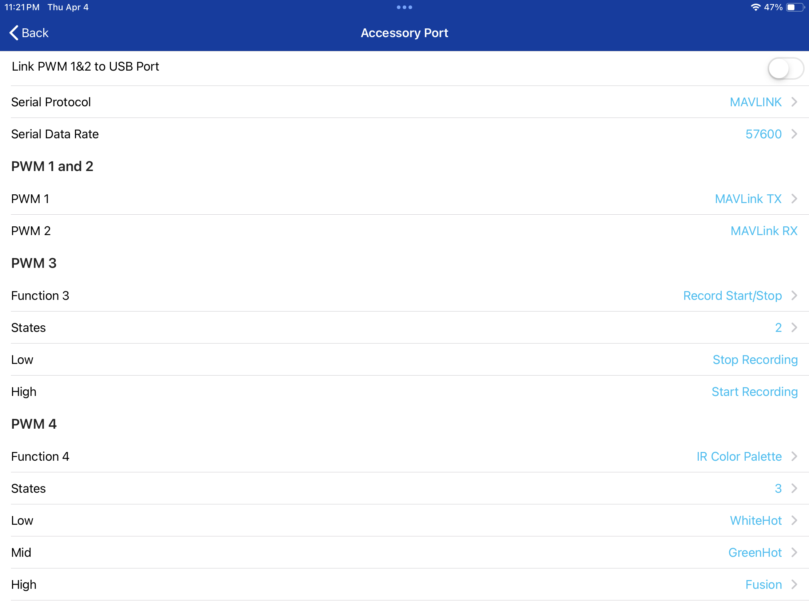
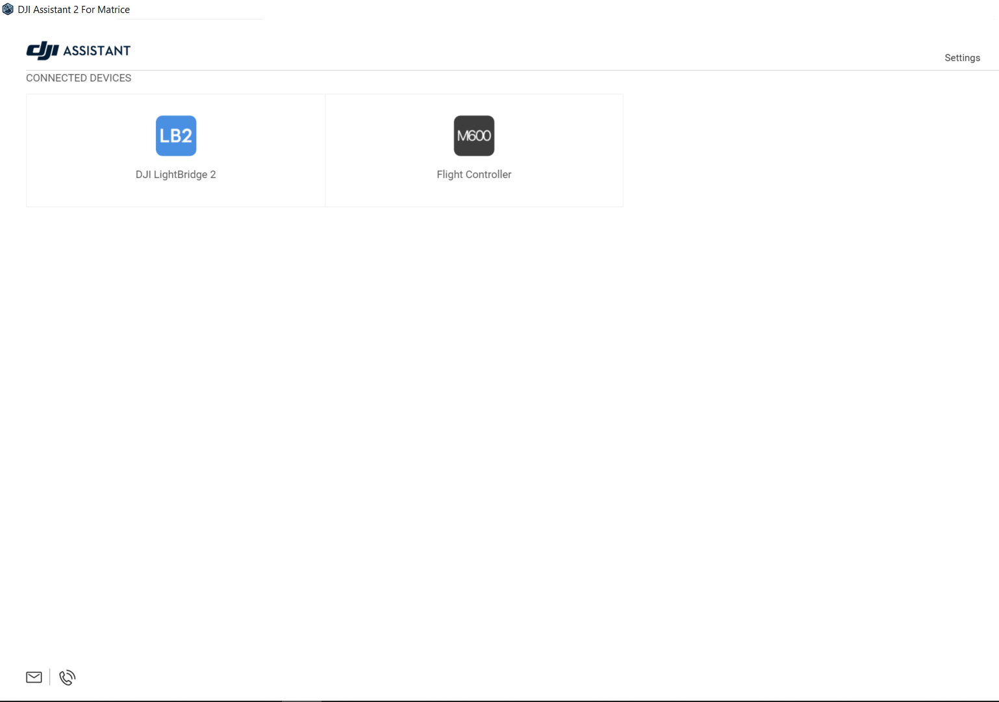
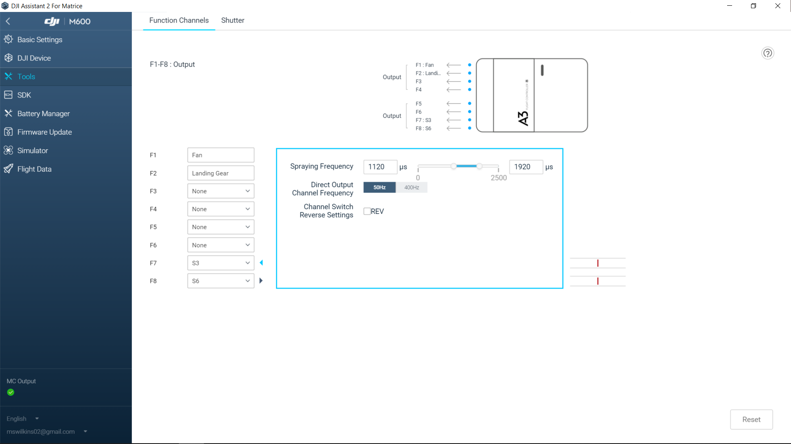

# Setup FLIR With DJI A3 And Lightbridge 2

This is to control the FLIR VUE PRO Through the DJI A3 and Lightbridge 2. Will Also work with DJI N3

This Uses the DJI Lightbridge 2 Channel Expansion Module. You can probably get this to work with the shutter button as well for taking Photos/Video, but the expansion module allows you to control more.

## FLIR Setup For PWM Control

Follow These Steps:

1. Download and open FLIR UAS App.

1. Connect to FLIR VUE PRO.

1. Navigate to the `Settings` page.

2. Go To `Connect`.

3. Go To `Accessory Port`.

4. Set your `Function 3` and `Function 4`.
5. Choose if it is a 3 State or a 2 State.
6. Mine is configured as F3 `Record Start/Stop` 2 State with Low as Stop and High as Start Recording.
7.  F4 is configured as `IR Color Pallette` with 3 States. I have `White Hot, Green Hot, and Fusion` selected. Chooes your prefered State range.

Note: I have `Fusion` and `White Hot` in my trained model.

`Scene` is set as `Default`, though I use `SAR` as well. feel free to expirment with what you like.

## Connection To A3/N3

Download `DJI Assistant 2 For Enterprise` or `DJI Assistant 2 For Matrice`. I have included the .exe for Assistant 2 For Matrice as sometimes Enterprise does not connect to the M600 A3. It is an older verion but is up to date on almost everything if not everything. Check the Repository if you would like it.

Connect a Micro USB port to the USB Hub on the Matrice 600. And turn the Copter on.

Open Assistant 2. You should see both the M600 and Lightbridge 2.

Click on `M600`

Navigate to `Tools`

Config What F-PORT you want to use. I used F7 and F8 as those both have 3 Way switches. Feel free to choose yours based on what Funtions you chose in the FLIR App. I Just used Default settings in Assistant 2 Output.

Grab The FLIR VUE PRO Accessory Cable. There are 3 outputs. We are using the `Blue/Black` and `Orange/Black` cables.

Plug these cables into the F-PORTS Chosen on Assistant 2. `Orange/Black` is `PWM 3`, `Blue/Black` is `PWM 4`

Once These Cables are All Connected to the A3 and FLIR VUE PRO, Flip the switches or turn the knobs that correspond to the ports you chose. Look at Assistant 2 and the FLIR app to confirm the correct ports are connected.
