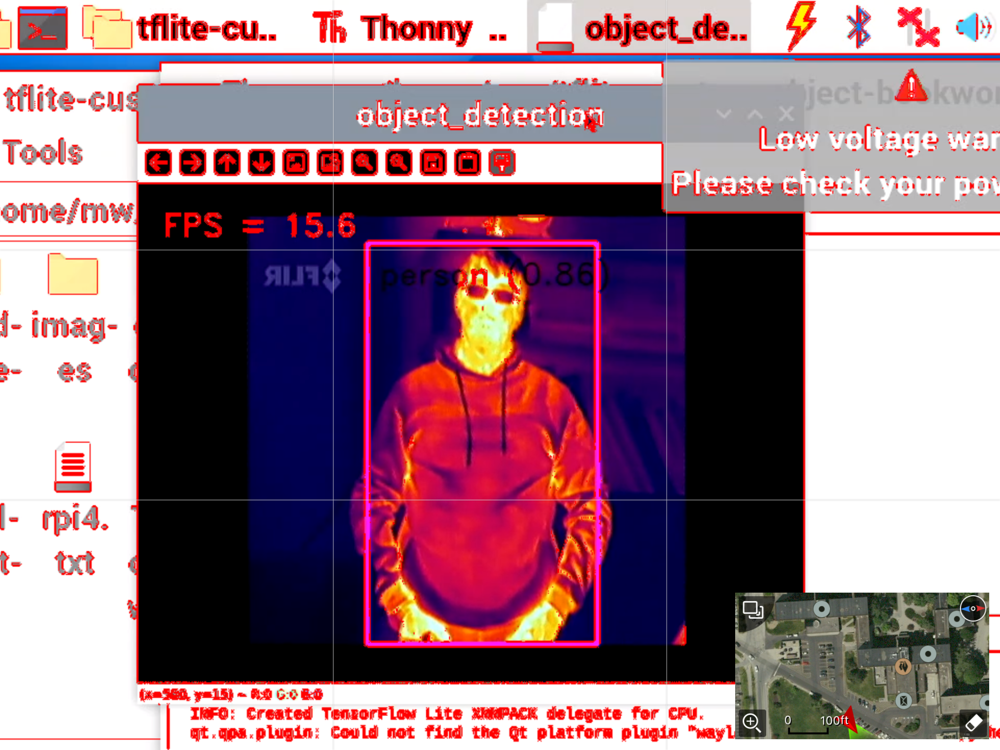
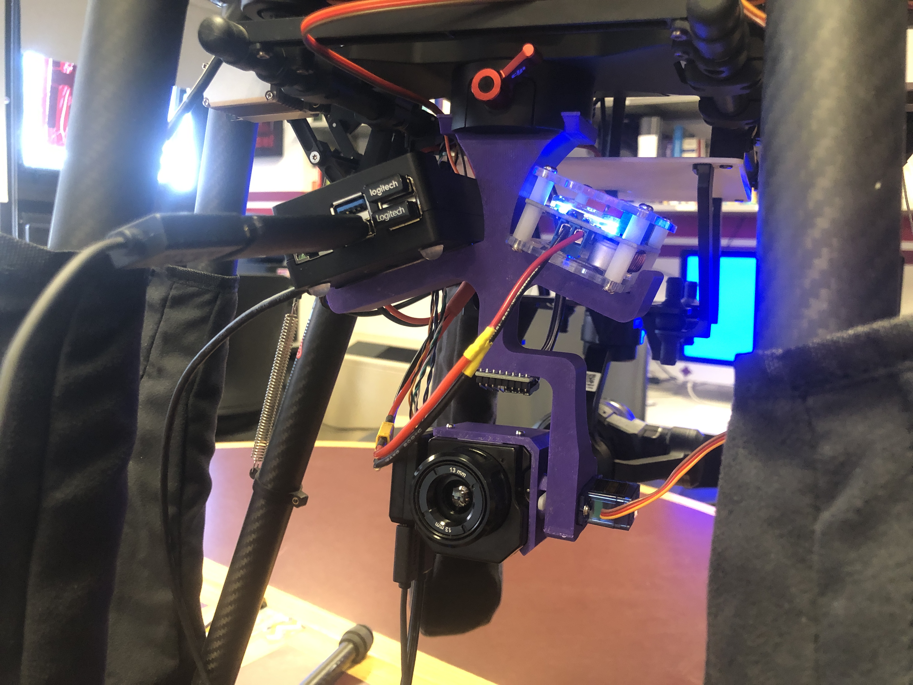

# DJI-M600-SAR




M600 Drone Custom Thermal Detection Payload With Gimbal Using Tensorflow Lite

This Project is currently not in its full state. It currently is a proof of concept that I wish to take further with updates over time.

## How to set up on Raspberry Pi for object detection (Note: Only tested on Pi 5 with Bookworm OS as of 4/1/2024)

Installation on a Fresh Install of Bookworm, please set up an internet connection beforehand

Type these commands into Command Terminal

Set up a VM if you want, I did not as this is the only purpose this Pi will be used for currently

``` shell
sudo apt-get update

sudo apt-get upgrade

sudo rm /usr/lib/python3.11/EXTERNALLY-MANAGED (stops externally managed error)

sudo pip3 install opencv-python

sudo pip3 install mediapipe
```

That is it for setup.

## Setting up the Hardware/Software for FLIR, RPI, and Gimbal

Please look at 3 Files:

FLIR SETUP with Assistant 2 and FLIR UAS

Mounting the RPI, FLIR, and Buck Converter (WIP)

Final Connections and DJI Go setup (WIP)

## Training your own model set

If you wish to do this, please take a look at the TRAIN YOUR OWN MODELS file if you want to capture/performance tune your own model set.

---

Note: The training method I use is using Google's Colab as I didn't want to set it up on my own machine.
